# hi, i'm bread 

> full-stack software engineer from portugal 🇵🇹
> building products, infrastructure and occasionally solving problems that shouldn't exist in the first place.

 

i'm tiago, a full-stack developer passionate about turning ideas into real products.

i enjoy building modern web applications, designing scalable backend systems, creating developer tools, and shipping projects that people actually use.

whether it's a SaaS dashboard, a Discord integration, an authentication system, or internal infrastructure, i'm probably working on it.

---

## currently

* 🚀 building products and internal tooling
* 🏢 working on HR and management platforms
* 🤖 developing Discord integrations & automation
* 🐧 daily driving Linux
* 📚 constantly learning new technologies
* ☕ surviving on caffeine and questionable sleep schedules

---

## tech stack

### languages

### frontend

### backend

### databases & orm

### auth & validation

### devops & infrastructure

### tooling

### exploring

---

## featured work

### Orbit

HR management platform focused on staffing, operations and community management.

### Feedbase

Feedback web tool designed for product teams.

---

## fun facts

* 🥖 yes, bread is my entire online identity.
* 🌙 most commits happen after midnight.
* 🚀 i love building things from scratch.
*  studies says that music has a 99,99% chance to likely had contributed to half my codebase.

---

## contact

  

  

  

 

  
    build • break • learn • repeat
  

